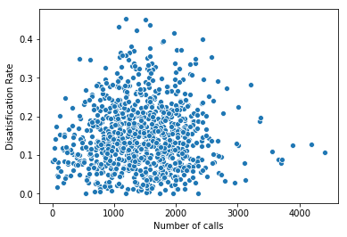

# A/B Testing Case Study with Python Example

- [A/B Testing Case Study with Python Example](#ab-testing-case-study-with-python-example)
  - [Background](#background)
    - [Create a dummy dataset for the case](#create-a-dummy-dataset-for-the-case)
  - [Step 1: Creat A/B Groups](#step-1-creat-ab-groups)

## Background

XYZ company has a customer service department to offer assistances for addressing any issues customers report after they purchase the products. At the end of the service, customers are requested to fill a survey for rating their satisfication level of the service: 1 for satisfied and 0 for disatisfied. The company analyzes this data to evaluate the performence of customer service agents as well as monitor overall customer satisification level. Two metrics are being collected for each customer service agent: number of calls they received and customer disatification rate of those calls. 

After reviewing the result, the company plans to roll out a new SOP training to all customer service agents, hoping this could help improve the performance and better customer ratings. However, before investing training resources at full scope, the company wanted to design a A/B testing, at a smaller scale, for experiementing whether the new SOP training can actually make any difference. 

As a result, a total of 1,000 customer service agents were selected randomly for the experiement. The goal is to distribute them into two groups, treatment and control, run the experiement for X months, and evaluate the efficacy of the training program. 

### Create a dummy dataset for the case

Use faker to create a dataframe that includes:

* Agent ID 
* Agent Name
* Number of calls
* Disatisfication Rate 

Check the dataframe df_agent

|    |   Agent ID | Agent Name    |   Number of calls |   Disatisfication Rate |
|---:|-----------:|:--------------|------------------:|-----------------------:|
|  0 |       1000 | Amber Hill    |               791 |             0.0515969  |
|  1 |       1001 | Raymond Boyd  |               478 |             0.402953   |
|  2 |       1002 | Karen Moore   |              1853 |             0.00966783 |
|  3 |       1003 | Julia Buckley |              1568 |             0.0289132  |
|  4 |       1004 | Renee Smith   |               119 |             0.106509   |

## Step 1: Creat A/B Groups

The principle challenge in assigning A/B groups is elimination of "selection bias" - typically introduced by improper randomization. To allow apples-to-apples comparison in an *ceteris paribus* experiement, the two groups need to meet a few criteria:

* each is representative of the entire population
* are independent from each other
* remain covariate balance[^1] between groups

In other words, these two groups need to be representative of the population and similar in every way. Therefore, we need to make sure samples in two groups start off from the same baseline before the experiement starts. That means, in this example, agents in each group should have similar disatisfication rate and number of customer calls. 

In this analysis, a two-stage cluster sampling method was adopted. 

Mahalanobis Distance[^2] method was adopted in this analysis to take account of multi-dimenstional metrics. 

[^1] Covariate balance: [Assessing Balance](https://cran.r-project.org/web/packages/MatchIt/vignettes/assessing-balance.html#:~:text=Covariate%20balance%20is%20the%20degree,across%20levels%20of%20the%20treatment.) 

[^2] Learn more about [Mahalanobis Distance method](http://mccormickml.com/2014/07/22/mahalanobis-distance/) and the [implementation in python](https://www.geeksforgeeks.org/how-to-calculate-mahalanobis-distance-in-python/). 